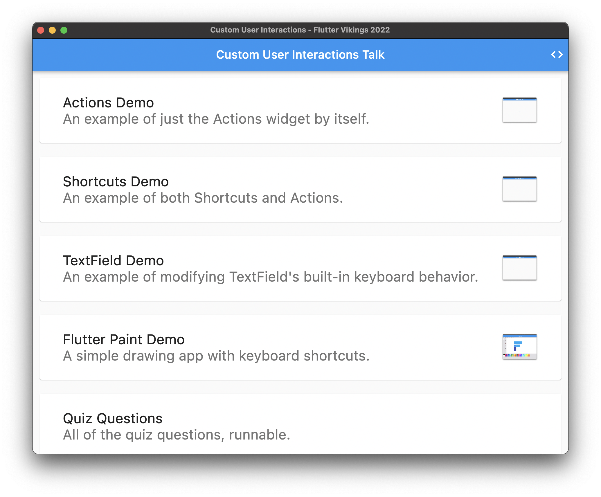
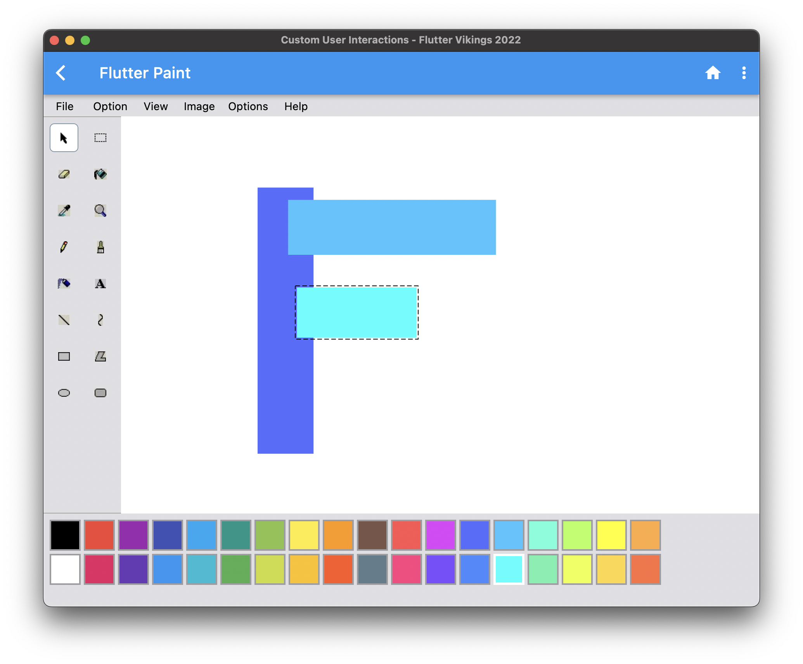

# Shortcuts / Intents / Actions example

An example of using the [Shortcuts](https://api.flutter.dev/flutter/widgets/Shortcuts-class.html), [Intent](https://api.flutter.dev/flutter/widgets/Intent-class.html)s, and [Actions](https://api.flutter.dev/flutter/widgets/Actions-class.html) system.

This was adapted from a talk given at Flutter Vikings 2022 ([original code](https://github.com/justinmc/flutter_shortcut_intent_action_talk)).

